# Twinmoji
Twinmoji is a fun and challenging game available in two exciting modes: Single Player and Battle Mode. 
  - In Single Player mode, test your speed and sharpness to find the identical emoji, between two cards (each containing up to 12 emojis), before time runs out.
  - In Battle Mode, compete head-to-head with another player to spot the only identical emoji.

##

## ✨ This app features
- Smooth SwiftUI animations for an engaging experience.
- Two gameplay modes:
  - Single Player: Race against the clock to find the repeated emoji.
  - Battle Mode: Turn-based competition where one player starts the countdown, and the other must find the match.
- Up to four emoji decks.
- Two difficulty levels and three countdown speed settings.
- Color-based countdown instead of a numeric timer for a more intuitive experience.
- Score tracking and win/lose conditions.

---

## 🛠️ Tech & Architecture
- Built with SwiftUI, leveraging declarative UI and animations.
- MVVM architecture, with a dedicated ViewModel handling game logic for each gameplay mode.
- Two main views for each gameplay mode: MenuView and GameView, along with several subviews.
- SplashView & HomeView
- Enums define available emoji decks and game states (instead of a dedicated model).

---

## 🏗️ Inspired by Paul Hudson
Twinmoji is inspired by a game concept from Paul Hudson, but with significant improvements:
- Added Single Player mode for solo challenges.
- Three new emoji decks to add variety.
- Refined playing & scoring system (win/lose conditions for a more strategic experience).
- Improved UI/UX elements, including custom colors.

---

## 🎮 Game rules
Single Player Mode
- Objective: Find the identical emoji between two cards before the countdown ends.
- Scoring:
    - Correct answer: Earn points based on speed and difficulty.
    - Wrong answer or timeout: Lose points.
    - Game End: Play ten rounds; the final score determines your performance.

Battle Mode
- Objective: Compete to find the identical emoji first.
- Scoring: 
    - Correct answer: +1 point.
    - Wrong answer or timeout: -1 point.
    - Game End: A player reaches 5 points and wins. // A player drops to -5 points and loses.

---

## 🚀 Installation
- To run the app locally, clone the repository and open the project in Xcode (version 15 or later). Then, build and run the project in the simulator or on a physical device (iOS 18.1 or greater).

---

## 📱 Supported Platforms
- Designed for iPhone: Optimized for iPhone screens with a seamless experience.
    - Recommended minimum screen size: 6.1 inches for optimal visibility and gameplay. Smaller screens may work but could affect layout.
- iPad Compatible: Fully functional on iPad with native support.
- Mac & Apple Vision: Expected to work via "Designed for iPad" compatibility (untested).
- App only runs in landscape mode.

---

## 🤝 Contributing
Contributions are welcome! If you want to contribute, please fork the repository, create a new branch, make your changes, and submit a pull request.

---

## 📜 License
This project is licensed under the MIT License - see the [LICENSE](LICENSE) file for details.
 

---

## 🎨 Color Reference

| Color      | Hex                                                                |
| ---------- | ------------------------------------------------------------------ |
| TwinmojiBlue |  |
| TwinmojiRed  |   |

---

## 📸 Screenshots
Below are some screenshots showcasing key views and features of the app.

    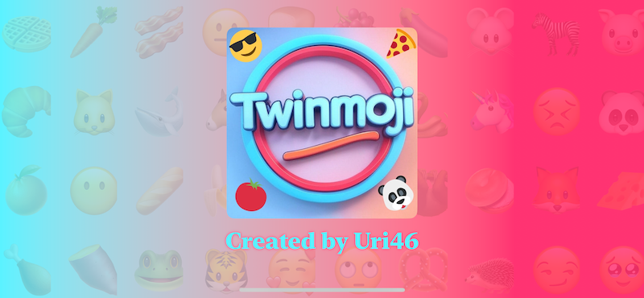
    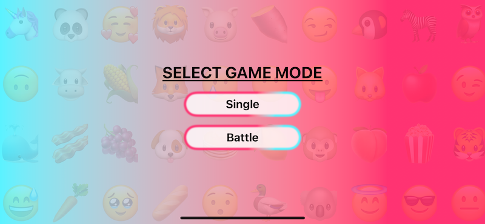
     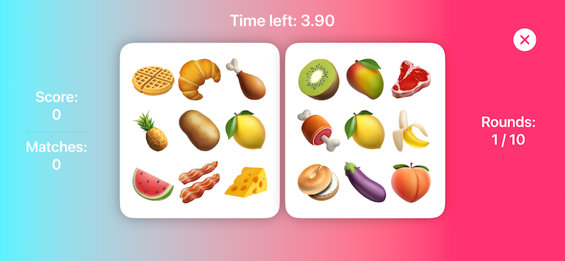
  

    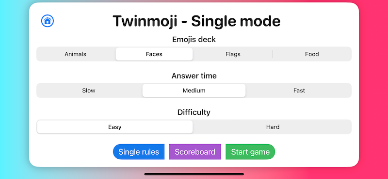
    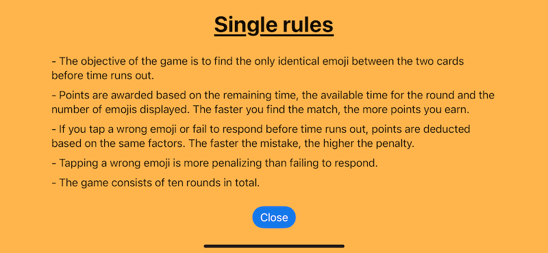
     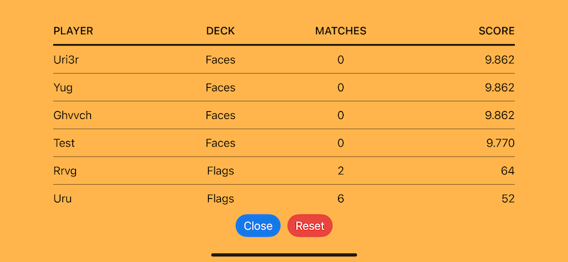
  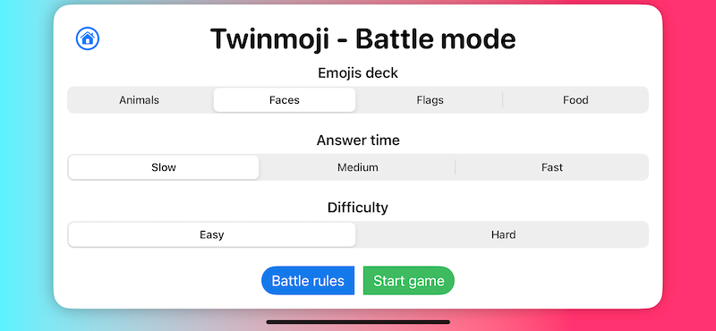

    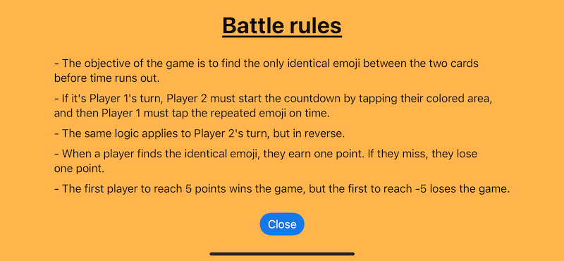
    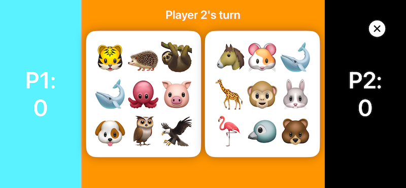
     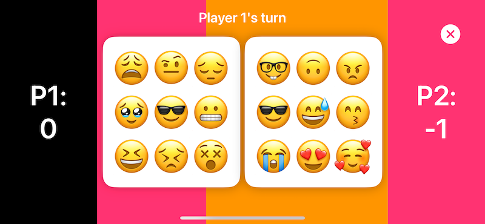
  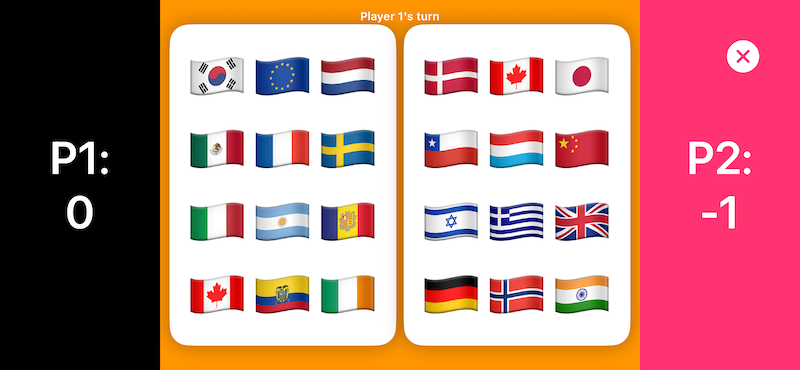

